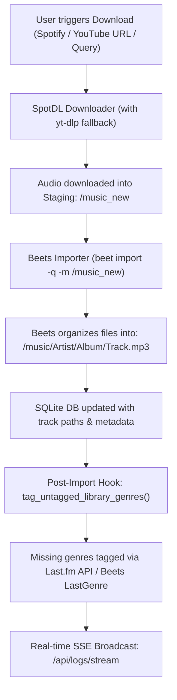

# Music Manager — Complete Architectural & Project Handbook

This document is the comprehensive master reference for the **Music Manager** platform. It details the complete project anatomy, host storage layout, Docker topology, Beets database schema, background ingestion pipelines, AI curation subsystems, and UI component structures.

---

## 1. Physical Host & Storage Infrastructure

### Host Environment
- **Operating System**: Debian Linux / OpenMediaVault (OMV)
- **Host IP**: `192.168.178.100` (LAN)
- **SSH Credentials**: `root` / `H@ppyF@mi!!y3332`
- **Application Web Port**: `8085` (`http://192.168.178.100:8085`)

### Host Filesystem & Storage Disks
The system utilizes two distinct physical disk mounts:

1. **System & Docker Application Disk** (`bf30c64b-47b4-4699-b768-f50d51147267`):
   - Linux Host Path: `/srv/dev-disk-by-uuid-bf30c64b-47b4-4699-b768-f50d51147267/Jacques_Documents/DockerFolder/music-manager/`
   - **Windows Direct Path**: `Y:\DockerFolder\music-manager\` (SMB Network Share)
   - *Direct Editing Note*: All application files, configs, and scripts can be read and edited directly on the Windows filesystem under `Y:\DockerFolder\music-manager\`. No file transfer piping is needed for code edits. Commands still execute via SSH.
   - Houses the application source code, Docker configs, Beets SQLite database, and JSON caches.

2. **Media Storage Disk** (`5c92a2d3-bb90-43b8-9626-372dd587ab8b`):
   - Main Library: `/srv/dev-disk-by-uuid-5c92a2d3-bb90-43b8-9626-372dd587ab8b/Music` (7,904 audio tracks)
   - Ingestion Staging: `/srv/dev-disk-by-uuid-5c92a2d3-bb90-43b8-9626-372dd587ab8b/Music_New` (downloads awaiting import)

---

## 2. Remote Project Directory Tree

```text
/srv/dev-disk-by-uuid-bf30c64b-47b4-4699-b768-f50d51147267/Jacques_Documents/DockerFolder/music-manager/
├── .env                         # Environment variables (ports, host paths, Ollama URL)
├── .env.example                 # Template for environment configuration
├── docker-compose.yml           # Docker service definition, ports, volume bindings
├── Dockerfile                   # Debian-bookworm container with Python 3.11, ffmpeg, chromaprint
├── requirements.txt             # Python dependencies (spotdl, beets, yt-dlp, fastapi, uvicorn)
├── README.md                    # Project overview
├── config/
│   └── beets/
│       ├── config.yaml          # Beets master configuration (plugins, inline fields, paths)
│       ├── library.db           # Canonical SQLite library database
│       ├── genre_cache.json     # Cached artist -> genre mappings
│       ├── missing_cache.json   # Cached album missing tracks inventory
│       ├── ollama_servers.json  # Discovered/configured Ollama server registry
│       └── state.pickle         # Beets internal state
└── app/
    ├── main.py                  # FastAPI server: API routes, anti-cache middleware, SSE streaming
    ├── services/
    │   └── manager.py           # Core engine: MusicManagerService (42 business logic methods)
    └── static/
        ├── index.html           # SPA structure: navigation, 6 tab panes, modals, toast container
        ├── style.css            # Dark glassmorphism styles, responsive grid, dynamic SVG styles
        └── app.js               # Client controller: DOM events, SSE client, dynamic SVG, API bindings
```

---

## 3. Docker Container Architecture (`music_manager`)

### `docker-compose.yml` Bindings
```yaml
services:
  music-manager:
    container_name: music_manager
    build: .
    restart: unless-stopped
    ports:
      - "8085:8085"
    environment:
      - MUSIC_DIR=/music
      - NEW_MUSIC_DIR=/music_new
      - BEETSDIR=/config/beets
      - PYTHONUNBUFFERED=1
      - OLLAMA_HOST=http://192.168.178.31:11434
      - OLLAMA_MODEL=qwen3.5:9b
    volumes:
      - ./app:/app/app
      - /srv/.../Music:/music
      - /srv/.../Music_New:/music_new
      - ./config:/config
```

### Host Path Compatibility Symlinks
Inside the container, paths stored in Beets SQLite that reference host mount points are automatically resolved via symlinks created during build:
```bash
ln -s /music /srv/dev-disk-by-uuid-5c92a2d3-bb90-43b8-9626-372dd587ab8b/Music
ln -s /music_new /srv/dev-disk-by-uuid-5c92a2d3-bb90-43b8-9626-372dd587ab8b/Music_New
```
In Python, `MusicManagerService.resolve_audio_path(raw_path)` maps between host `/srv/.../Music` and container `/music` seamlessly.

---

## 4. Beets Configuration & Database Schema

### `config/beets/config.yaml`
- **Active Plugins**: `ftintitle`, `inline`, `missing`, `duplicates`, `fetchart`, `embedart`, `musicbrainz`, `lastgenre`
- **LastGenre Config**: Source: album, count: 5, separator: `", "`, canonical: `yes`
- **File Organization Patterns**:
  - Album tracks: `$custom_artist/$custom_album/$custom_track_name`
  - Singletons: `$custom_artist/Non-Album/$custom_track_name`
  - Compilations: `Compilations/$custom_album/$custom_track_name`
- **Inline Custom Fields**:
  - `custom_artist`: Strips `feat.`, `ft.`, and collaborations to enforce clean folder grouping.
  - `custom_track_name`: Formats disc and track numbering (e.g. `1-04 TrackTitle.mp3`).

### SQLite Database (`/config/beets/library.db`)
Key tables:
1. **`items`** (7,904 records):
   - `id`: Integer primary key
   - `title`: Track title string
   - `artist`: Primary artist string
   - `album`: Album name
   - `genre`: Comma-separated genre tags (e.g. `"Punk Rock, Pop Punk"`)
   - `year`: Recording year integer
   - `length`: Track length in seconds (float)
   - `path`: Binary path string (e.g. `b'/music/Artist/Album/Track.mp3'`)
2. **`albums`**:
   - `id`, `album`, `albumartist`, `year`, `genre`, `artpath`

---

## 5. End-to-End Ingestion Pipeline



---

## 6. Detailed Tab & UI Module Breakdown

The single-page application is structured into **6 modular tabs** switched via `#navbar-tabs .nav-item`:

### 1. Download Tab (`#pane-download`)
- URL / search term input for Spotify tracks, albums, playlists, or YouTube links.
- "Auto-complete recent albums" feature scanning missing album tracks.
- Live streaming output console showing SpotDL progress.

### 2. Playlist Generator Tab (`#pane-playlist`)
- **Capacity Controls**:
  - Duration picker (hours, minutes) bidirectionally synced with Song Count picker (at ~3.8 min/song avg).
- **Curator Engine Selectors (6 Systems)**:
  1. *Genre Combiner*: Multi-genre chips from 207 library genres. Interleaved or weighted shuffle.
  2. *Random Library*: Pure random or Smart Shuffle (anti-clustering by artist).
  3. *Decade Blend*: 1960s to 2020s decade pills with chronological sequencing toggle.
  4. *Artist Seed & Flow*: Searchable chips of 1,210 artists. Seeds tracks + shared-genre adjacent artists.
  5. *AI Curator*: Natural language prompt sent to local Ollama LLM (`qwen3.5:9b`). Fuzzy-matched against Beets library.
  6. *Dynamic Venn Overlap*:
     - 1 to 4 circles with dynamic Add / Remove circle buttons.
     - Live Overlap Breakdown: Calculates individual circles, all pairwise overlaps ($\binom{N}{2}$), Core Sweet Spot ($\bigcap C_i$), and Combined Pool ($\bigcup C_i$).
     - Clickable targeting: click any SVG zone or pill chip to select that exact crossover region.
- **Preview & Export**:
  - Interactive table displaying generated tracks, duration, genre, and physical file existence check.
  - Export buttons: `.m3u8`, `.pls`, `.json`, and **Direct `.zip` bundle** (streamed via `StreamingResponse`).

### 3. AI Recommendations Tab (`#pane-recommendations`)
- **Taste Profile Analyzer**: Evaluates top genres, artist distribution, and listening patterns.
- **Ollama LAN Node Manager**:
  - Probes default host (`http://192.168.178.31:11434`).
  - Scans `/24` subnet for active Ollama instances.
  - Allows selecting active model from dropdown.
- **Recommendation Engine**: Generates missing music suggestions based on taste profile, with one-click "Download All" queuing.

### 4. Missing Tracks Tab (`#pane-missing`)
- Integrates Beets `missing` plugin.
- Identifies incomplete albums in the library and indexes missing tracks into `missing_cache.json`.
- Batch download actions to complete albums.

### 5. Staging & Library Maintenance Tab (`#pane-staging`)
- **Manual Music Import Dropzone**:
  - Drag & drop music folders (recursively parses all subfolders and tracks), loose audio files, or `.zip` archives.
  - "Select Music Folder" directory picker and "Select Audio Files" file picker.
  - Automatic `.zip` extraction and relative path preservation.
  - Auto-import switch: automatically triggers Beets identification, metadata embedding, cover art retrieval, and library filing upon upload.
- Displays files in staging directory awaiting import with 30-second audio preview player.
- Triggers:
  - **1-Click Beets Import**: Executes `beet import -P -q -m` followed by loose track singleton import.
  - **Sanitize & Deduplicate**: Purges dead paths, phantom entries, and orphan album rows.
  - **Fetch All Artwork**: Runs `beet fetchart -f` across all albums.
  - **Retag Untagged Genres**: Backfills 100% of untagged tracks via Last.fm.

### 6. Terminal Console Tab (`#pane-terminal`)
- Live Server-Sent Events (SSE) log console on `/api/logs/stream`.
- Real-time command feedback, copy-to-clipboard, and clear console actions.

---

## 7. Python Backend Architecture (`MusicManagerService`)

`manager.py` defines the centralized `MusicManagerService` containing 42 core methods:

| Functional Area | Key Methods |
| :--- | :--- |
| **Ingestion & Downloads** | `download_track_or_url`, `_download_query`, `_ytdlp_fallback`, `download_batch_tracks`, `import_library` |
| **Missing Album Detection** | `scan_and_find_missing`, `get_missing_tracks`, `get_cached_missing_tracks`, `auto_complete_recent_albums` |
| **Library Hygiene & Tagging** | `sanitize_and_deduplicate_library`, `tag_untagged_library_genres`, `tag_entire_library_genres`, `_fetch_artist_genre_lastfm`, `fetch_all_art` |
| **Stats & Metadata** | `get_library_stats`, `count_disk_files`, `get_library_genre_stats`, `get_playlist_meta`, `resolve_audio_path` |
| **Playlist Generation** | `generate_playlist` (Modes: `genres`, `random`, `decade`, `artist_seed`, `ai`, `venn`), `get_venn_stats` |
| **Export Engines** | `build_m3u8_content`, `build_pls_content`, `create_playlist_zip` |
| **Ollama AI Integration** | `probe_ollama_host`, `scan_network_for_ollama`, `add_ollama_server`, `set_active_ollama_server`, `get_taste_profile`, `get_ollama_status` |
| **Logging & SSE** | `broadcast_log`, `subscribe_logs`, `unsubscribe_logs`, `_run_command` |

---

## 8. Development & Deployment Tooling (in `scratch/` & Workspace)

| Script | Purpose | Command |
| :--- | :--- | :--- |
| `audit.py` | Audits HTML IDs vs JS `getElementById`, Tab IDs, and API endpoints. | `python audit.py` |
| `transfer_all.py` | Pushes all 5 local files to remote server via binary stdin piping (`plink.exe`). | `python transfer_all.py` |
| `restart_and_verify.py` | Restarts Docker container and verifies `/api/health`. | `python restart_and_verify.py` |
| `node -c app.js` | Validates JavaScript syntax before deployment. | `node -c app.js` |
| `python -m py_compile main.py manager.py` | Compiles Python files to ensure zero syntax errors. | `python -m py_compile ...` |
| `update_library_genres.sh` | SSH-triggerable detached 5-genre bulk upgrade across entire library. | `./update_library_genres.sh` |
| `check_genre_update.sh` | Checks status and progress of background 5-genre bulk upgrade. | `./check_genre_update.sh` |

---

## 9. Remote SSH Detached Execution Workflow

To upgrade the entire library to 5 genres per track without keeping an SSH terminal open:
```bash
# 1. SSH into the server as root
ssh root@192.168.178.100

# 2. Trigger the detached background update
./update_library_genres.sh

# 3. Disconnect and close terminal immediately.
# The upgrade continues running autonomously inside Docker.

# 4. (Optional) Check status or live logs anytime:
./check_genre_update.sh
tail -f /srv/dev-disk-by-uuid-bf30c64b-47b4-4699-b768-f50d51147267/Jacques_Documents/DockerFolder/music-manager/config/genre_update.log
```

---

## 10. Distribution & Automated Upgrades (GitHub Container Registry + Watchtower)

### Automated Pipeline Architecture
1. **GitHub Actions** (`.github/workflows/docker-publish.yml`): Automatically compiles multi-platform Docker images upon pushing to `main`, publishing to `ghcr.io/<owner>/music-manager:latest`.
2. **Watchtower Auto-Updater**: Runs as an isolated companion container on the client machine, checking `ghcr.io` every 3600 seconds and performing zero-downtime rolling updates with automatic image cleanup.
3. **Client Distribution Bundle** (`music-manager-client/`):
   - `docker-compose.yml`: Client compose file running `music-manager` (from GHCR) and `watchtower`.
   - `.env.example`: Single-path base storage declaration (`STORAGE_PATH`), `PORT`, and optional `OLLAMA_HOST`.
   - `README.md`: 3-step quick installation guide and OMV/NAS instructions.
4. **Auto-Seeding Defaults**: `MusicManagerService._ensure_beets_config()` automatically creates a working `config.yaml` on first startup if the mounted config volume is empty.


